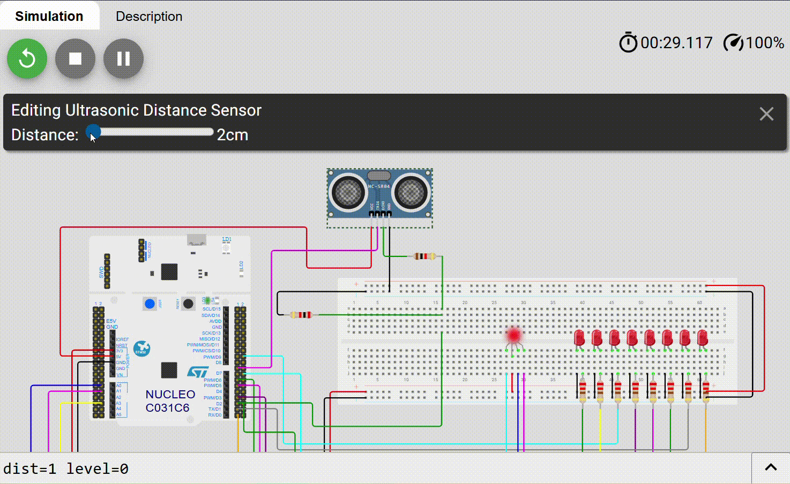

# STM32 Ultrasonic Timer Project
Ultrasonic distance measurement system implemented on STM32 using TIM14 as a 1µs free-running time base.  
Distance is calculated from pulse width measurement and displayed through an 8-LED bar and RGB status indicator.

## Demo

## Hardware in Wokwi

See the interactive simulation here: [Wokwi Project](https://wokwi.com/projects/456407195657967617)

## Overview

This project demonstrates precise time measurement using a hardware timer (TIM14) configured as a microsecond counter.  
An ultrasonic sensor (HC-SR04 compatible) is used to measure distance, and the result is visualized through:

- 8 discrete LEDs (10 cm per LED)
- RGB LED status indicator
- UART debug output

The timer operates in free-running mode and is read directly to compute pulse width duration.

## Key Concepts Demonstrated

- System clock configuration (48 MHz HSI)
- Timer prescaler calculation
- Microsecond time base generation
- Free-running hardware counter
- Overflow handling in 16-bit timer
- Pulse width measurement via polling
- Low-level GPIO control using BSRR register
- Modular driver architecture

## Hardware

- **MCU:** STM32C0 Series (e.g., STM32C031)
- **Sensor:** HC-SR04 Ultrasonic Sensor
- **Display:**
  - 8 LEDs connected to GPIOB (PB0–PB7)
  - RGB LED for status indication
- **Clock Source:** Internal HSI 48 MHz

## Timer Configuration

TIM14 configuration:

- Prescaler: `47`  
- Counter Period: `65535`  
- Counter Mode: `Up`  
- Timer Frequency: `48 MHz / (47 + 1) = 1 MHz`
- Result: `1 tick = 1 µs`
- Maximum measurable time before overflow: `65536 µs ≈ 65 ms`

## Distance Calculation

The ultrasonic sensor measures round-trip time of sound waves.

- Speed of sound: `343 m/s ≈ 0.0343 cm/µs`
- Considering round trip: `distance = time_us / 58`
- Each LED represents 10 cm: `LEDs ON = distance / 10`
- Maximum display range: ``80 cm.

## Software Architecture

Project modules:

- `app.c` – Application logic
- `sensor_distance.c` – Ultrasonic driver
- `led.c` – LED driver (BSRR-based control)
- `led_rgb.c` – RGB LED control
- `config.h` – System configuration parameters

STM32 HAL drivers and peripheral initialization were generated using STM32CubeMX.

## Measurement Flow

1. Generate 10 µs pulse on TRIG
2. Wait for ECHO rising edge
3. Capture timer counter value
4. Wait for ECHO falling edge
5. Capture timer counter value
6. Compute time difference (with overflow handling)
7. Convert time to distance
8. Update LED bar and RGB indicator

## Features

- Microsecond resolution measurement
- 16-bit overflow handling
- Active-low LED control
- Direct register manipulation via BSRR
- UART debug output
- Modular and scalable structure

## Future Improvements

- Replace polling with Input Capture mode
- Implement interrupt-driven measurement
- Add digital filtering (moving average)
- Remove blocking delays
- Implement non-blocking architecture

## Author

Jordan Willian Marques Pereira  
Embedded Systems Engineering

